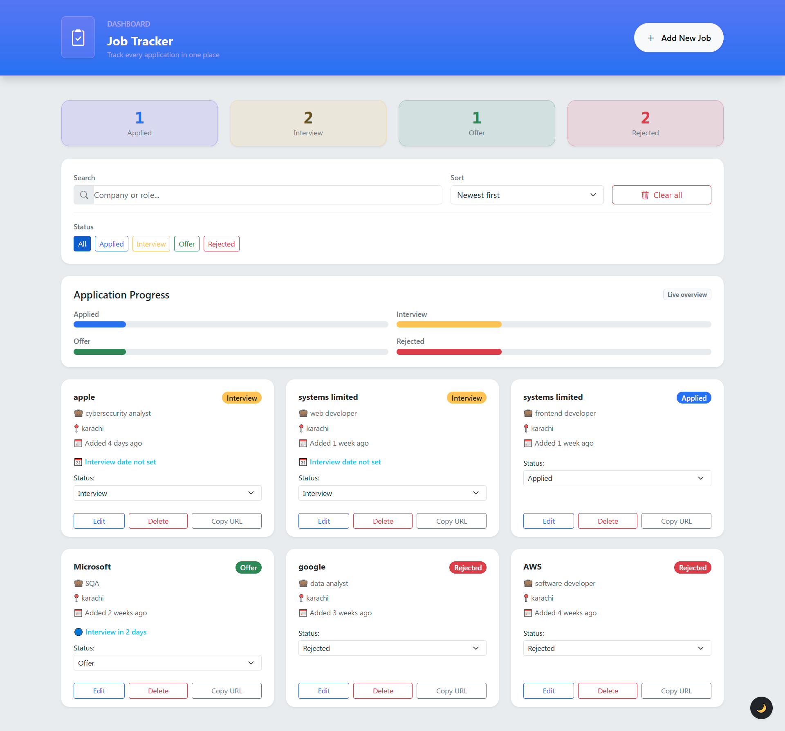
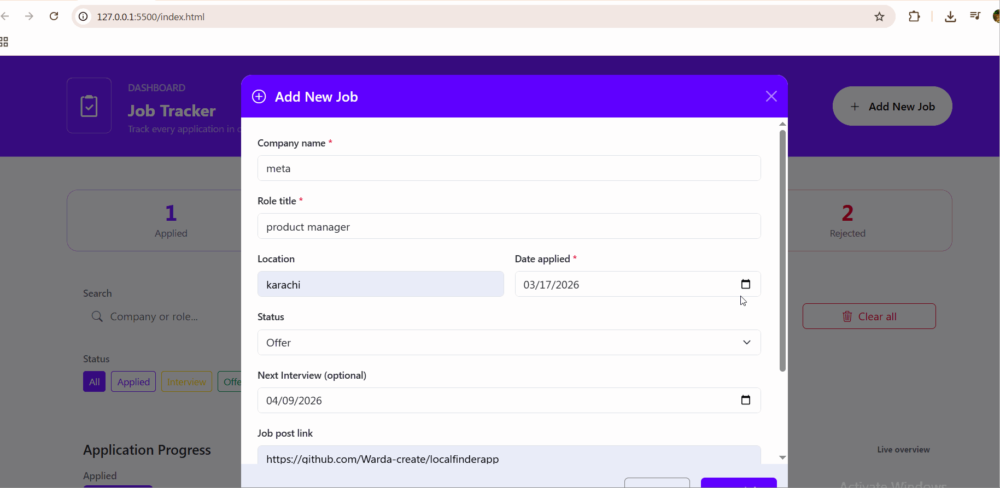
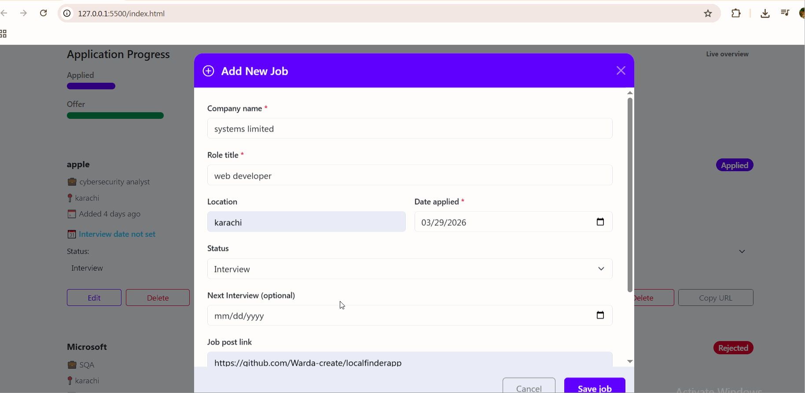
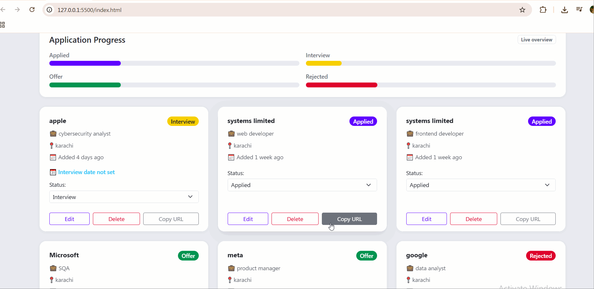

# Job Tracker

A simple web app to track job applications, interviews, offers, and rejections. Built as part of my learning journey in frontend development.

I am still learning, so the code might not be perfect. I got stuck implementing the **interview date reminder feature**, and I used AI help to make it work. I also used Claude AI to **sort and clean my code** after building the project.

---

## Table of Contents

- [Features](#features)
- [Screenshots & demos](#screenshots--demos)
- [Demo (live)](#demo-live)
- [How It Works](#how-it-works)
- [Getting Started](#getting-started)
- [Project structure](#project-structure)
- [Learning Notes](#learning-notes)
- [Future Enhancements](#future-enhancements)
- [Technologies Used](#technologies-used)

---

## Features

- Add new jobs with details: company, role, location, status, date, interview date, link, and notes.
- Inline status dropdown for updating job progress quickly.
- **Interview reminders**:
  - 🔴 Interview Today
  - 🟡 Interview Tomorrow
  - 🔵 Interview in X days
- Search jobs by company or role.
- Filter jobs by status (Applied, Interview, Offer, Rejected).
- Sort jobs by date (newest/oldest) or company name.
- Delete single jobs or clear all jobs.
- Copy job post URL to clipboard (direct copy without opening modal).
- Stats and progress bars for visual tracking.
- Responsive design using Bootstrap 5.

---

## Screenshots & demos

### Dashboard



### Add a new job



### Edit a job



### Copy job URL



---

## Demo (live)

- [https://github.com/Warda-create/jobtracker](https://github.com/Warda-create/jobtracker)

---

## How It Works

1. Click **Add New Job** to open the modal form.
2. Fill in the job details and save.
3. Jobs appear as cards in the main grid.
4. You can:
   - Edit jobs by clicking **Edit**
   - Delete jobs with **Delete**
   - Update status inline with the dropdown
   - See interview reminders if an interview date is set
5. Search, sort, and filter your jobs to easily track progress.
6. Stats and progress bars update automatically.

---

## Getting Started

1. Clone the repository:
   ```bash
   git clone https://github.com/Warda-create/jobtracker.git
   ```
2. Open `index.html` in your browser.
3. Use the app to start adding and tracking your jobs.
4. Optional: Deploy on GitHub Pages for a live demo.

---

## Project structure

```text
jobtracker/
├── index.html
├── app.js
├── style.css
├── assets/
│   ├── dashboard.png
│   ├── addingnewjob.gif
│   ├── editingjob.gif
│   └── copyingurl.gif
└── README.md
```

---

## Learning Notes

- I am learning frontend development, so this project helped me practice HTML, CSS, JavaScript, and Bootstrap 5.
- I struggled with the interview date reminder logic, so I got help from AI to make it work.
- After building the project, I used Claude AI to sort, clean and comment out my code for better readability.
- The project is a work-in-progress; I am still learning how to write cleaner and more efficient code.

---

## Future Enhancements

- Add local notifications for upcoming interviews.
- Implement drag-and-drop reordering of jobs.
- Add login and multi-user support.
- Improve styling and animations.

---

## Technologies Used

- HTML5
- CSS3 / Bootstrap 5
- JavaScript (ES6)
- LocalStorage for data persistence
- AI support for code improvement and logic help

---

This project is a learning experiment. I am not an expert yet, but every project helps me improve!
